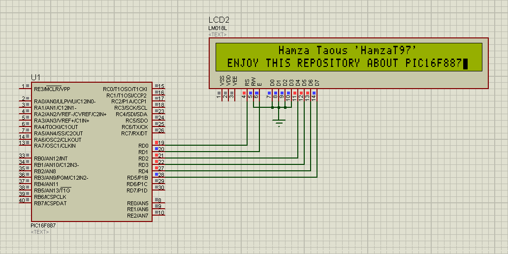

# PIC16F887_PIC
The main goal of this repository is to show you how we can deal with PIC16F887 microcontroller without using any library or predefined function, all we will need to do this is its datasheet and microC PRO compiler. For this reason, I didn't put any comment in all the codes you're going to find here in this repository, so it's up to you to understand every single line based on the datasheet (PDF document). We will see how we can configure I/O pins, use interrupts and timers (timer and counter modes), use CCP modules, compare analog voltages using analog comparators, read analog voltages using ADC, and finally read and write data in EEPROM and Flash memories.        

Ultimately, I hope you enjoy this work and get the pleasure from it and I remain at your entire disposal, just contact me at my personal Gmail hamzataous847@gmail.com if you have any questions or if you need any kind of assistance.
